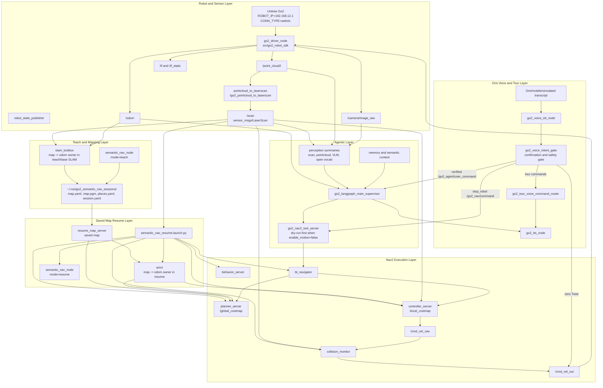
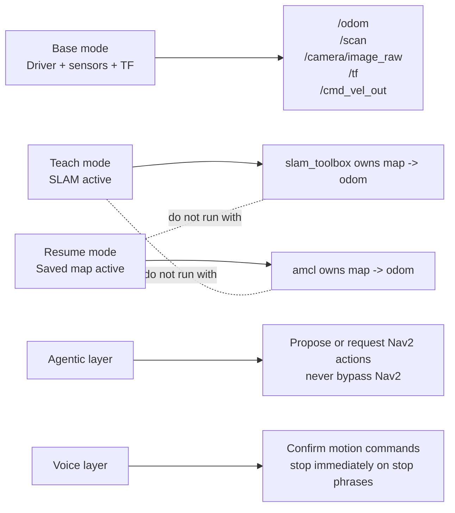
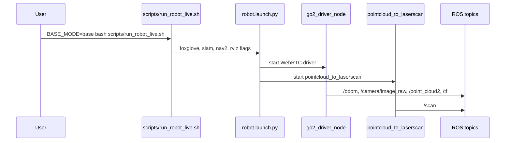
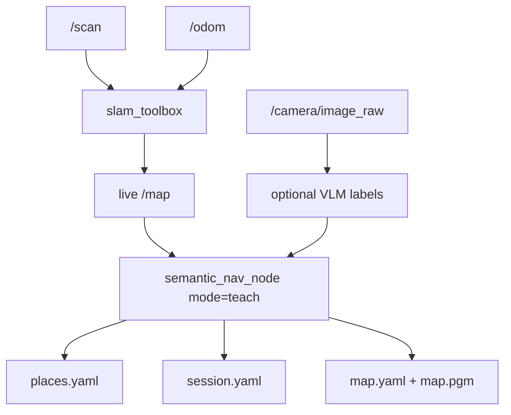
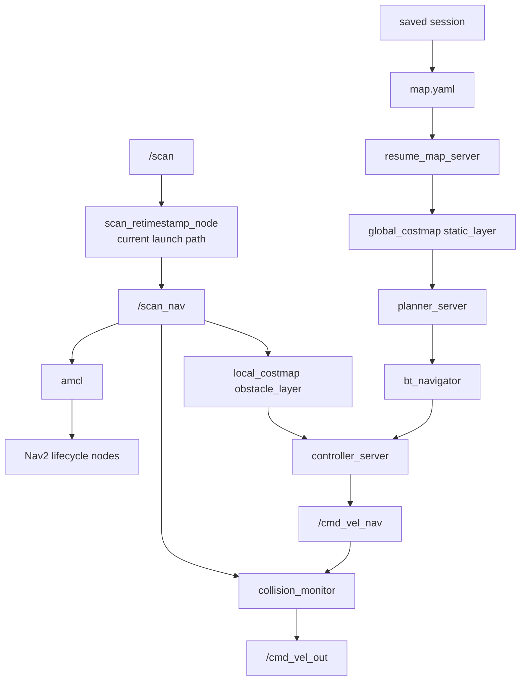
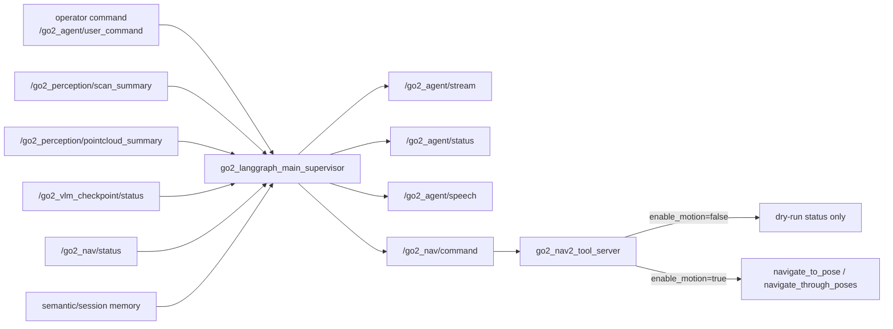
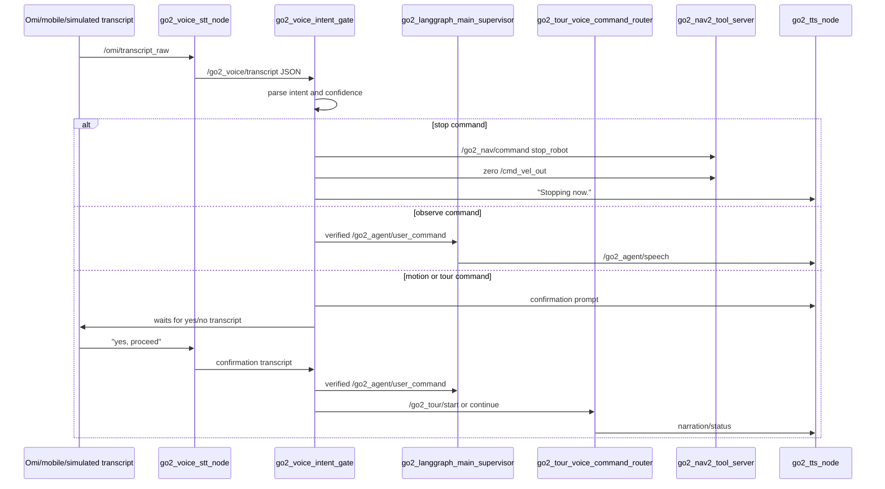
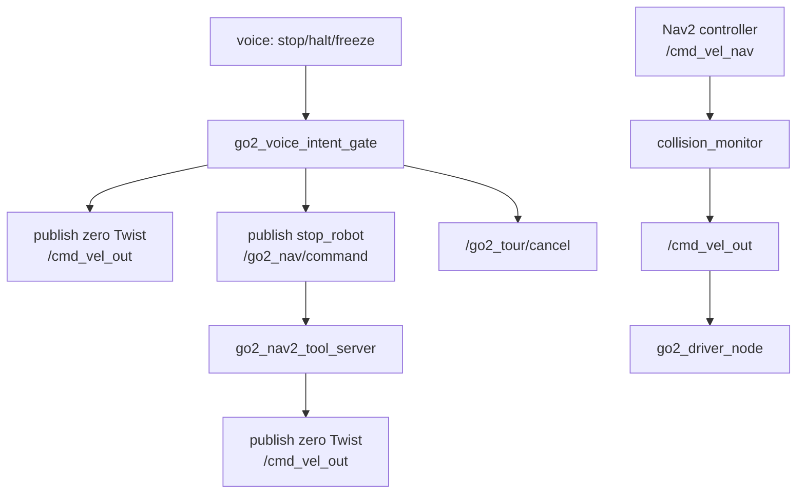

# Sparky Go2 Architecture

This document explains how the major packages, launch layers, topics, and safety gates work together.

## Layered System View



## Runtime Ownership Rules



The most important rule is that only one localization system should own `map -> odom` at a time:

- Teach/SLAM: `slam_toolbox`
- Resume/saved map: `amcl`

## Base Bringup Flow



Mode defaults in `scripts/run_robot_live.sh`:

| `BASE_MODE` | SLAM | Nav2 | RViz |
| --- | --- | --- | --- |
| `base` | false | false | true |
| `teach` | true | false | false |
| `resume` | false | true | true |

For semantic resume overlay, prefer base bringup plus `scripts/run_semantic_nav_resume.sh` so the overlay owns the saved map, AMCL, and Nav2 instance.

## Semantic Teach Flow



Teach mode creates the assets that resume mode and tours depend on:

- occupancy map
- saved session metadata
- named semantic places
- optional VLM summaries and labels

## Semantic Resume and Nav2 Flow



Current launch file:

```text
src/go2_semantic_nav_agent/launch/semantic_nav_resume.launch.py
```

Current scan path in that launch:

```text
/scan -> scan_retimestamp_node -> /scan_nav -> AMCL, costmaps, collision_monitor, semantic_nav_node
```

Costmap stability guidance:

- global costmap should primarily use the saved map
- local costmap and collision monitor should handle live obstacles
- avoid making the global planner chase scan noise unless intentionally testing dynamic global rerouting

Runtime flag:

```bash
export GO2_GLOBAL_LIVE_OBSTACLES=0
```

## Agentic Observe/Explore Flow



The agentic layer should be brought up in observe-only mode first:

```bash
ros2 launch go2_agentic_system explore_mode.launch.py enable_motion:=false
```

Enable motion only after base Nav2/resume mode is stable.

## Omi Voice and Tour Flow



Key voice topics:

| Topic | Direction | Purpose |
| --- | --- | --- |
| `/omi/transcript_raw` | input | simulated or Omi/mobile transcript text |
| `/go2_voice/transcript` | STT output | normalized transcript JSON |
| `/go2_voice/verification_request` | gate output | confirmation prompt |
| `/go2_voice/verification_state` | gate output | state machine events |
| `/go2_agent/user_command` | gate output | verified commands for LangGraph |
| `/go2_nav/command` | gate/tool output | stop/navigation tool commands |
| `/go2_tts/say` | gate output | immediate speech request |
| `/go2_tour/status` | tour output | tour state |
| `/go2_tour/narration` | tour output | checkpoint narration |

Voice command policy:

| Command type | Confirmation | Motion |
| --- | --- | --- |
| stop/halt/freeze | no | immediate stop only |
| where are we | no | none |
| what do you see | no | none |
| tell me a fun fact | no | none |
| navigate to place | yes | via agent/Nav2 only |
| start/continue tour | yes | via agent/Nav2 only |

## Tour Route and Memory Files

Tour router path:

```text
~/.ros/go2_semantic_nav_sessions/<session_name>/tours/sjsu_ads_department_tour.json
```

Example session layout:

```text
~/.ros/go2_semantic_nav_sessions/default/
  map.yaml
  map.pgm
  places.yaml
  session.yaml
  tours/
    sjsu_ads_department_tour.json
```

Example route:

```json
{
  "tour_id": "sjsu_ads_department_tour",
  "title": "Applied Data Science Department Tour",
  "requires_resume_mode": true,
  "checkpoints": [
    {
      "checkpoint_id": "digital_twin_lab",
      "place_id": "digital_twin_lab",
      "name": "Digital Twin Lab",
      "narration": "This area supports robotics, simulation, and digital twin experimentation.",
      "fun_fact": "Digital twins let researchers test systems virtually before deploying them in the real world."
    }
  ]
}
```

The current tour voice router prepares status and narration. It does not directly drive the robot. Navigation should still flow through the agentic supervisor and `go2_nav2_tool_server`.

## Safety-Critical Paths



Autonomous motion must pass through:

```text
agent or Nav2 tool -> Nav2 action -> controller_server -> /cmd_vel_nav -> collision_monitor -> /cmd_vel_out
```

Direct autonomous movement around Nav2 is not part of the intended architecture.

## Common Failure Boundaries

| Symptom | Likely layer |
| --- | --- |
| no `/scan` | driver, point cloud, or pointcloud_to_laserscan |
| `/scan` exists but Nav2 will not activate | Nav2 lifecycle, costmap config, TF, or map/localization |
| map warnings in base mode | map-consuming path started without map source |
| `navigate_to_pose` unavailable | Nav2 lifecycle did not reach active state |
| voice asks confirmation but nothing moves | expected if `enable_motion:=false`, route missing, or agent/Nav2 not running |
| tour says route missing | create the JSON route under the selected session `tours/` directory |

